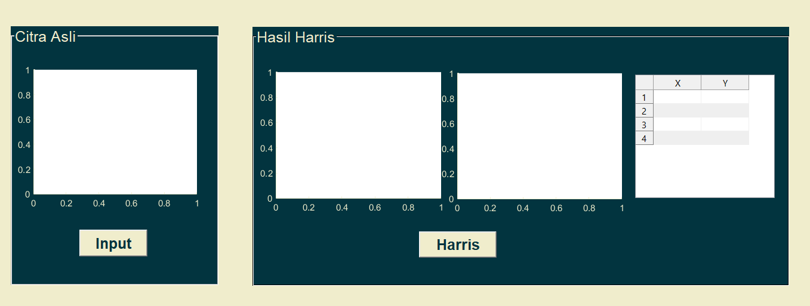
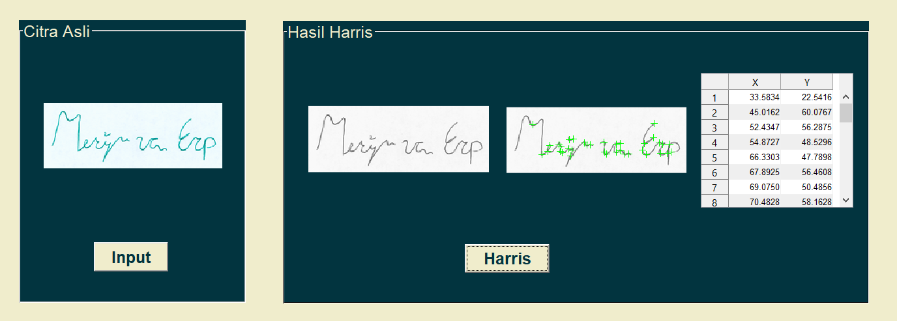

# Digital Image Processing Course Project

### This project is an assignment from a digital image processing course entitled **"Implementation of Feature Extraction Using the Harris Method in Signature Image"**. This project is implemented using the matlab application and the signature image data downloaded from kaggle. Here is the [link](https://www.kaggle.com/datasets/divyanshrai/handwritten-signatures).

 

# How To Install

### Install all file and run it on your matlab. 

 

# ScreenShot

